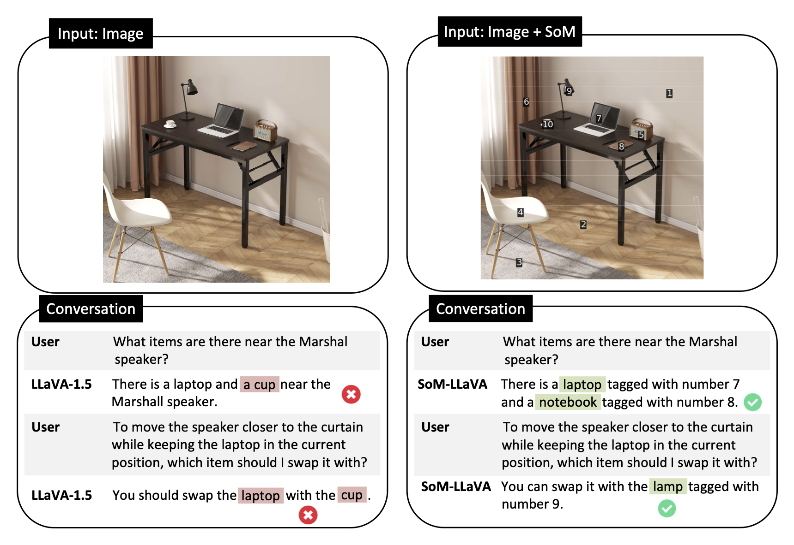
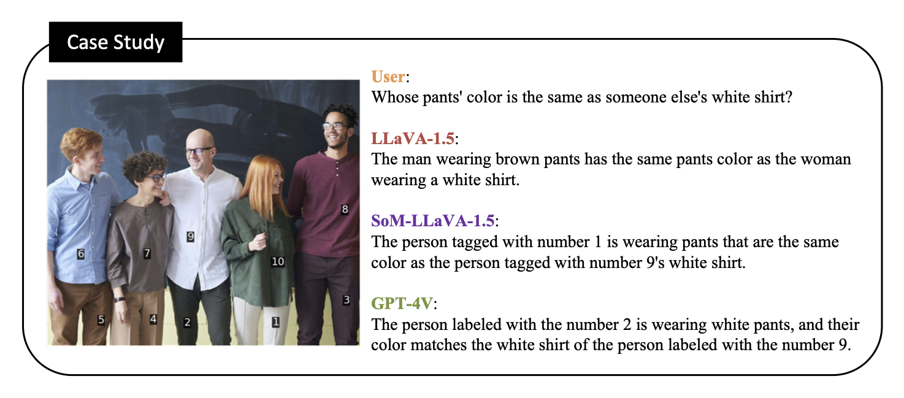
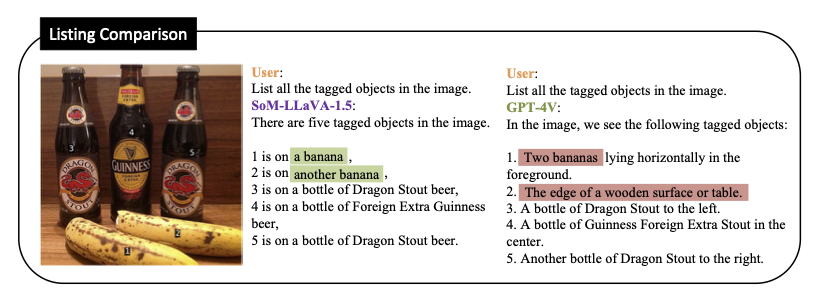

# :pencil: List Items One by One: A New Data Source and Learning Paradigm for Multimodal LLMs
*Empowering Multimodal LLMs with Set-of-Mark Prompting and Improved Visual Reasoning Ability.*


**List Items One by One: A New Data Source and Learning Paradigm for Multimodal LLMs** [[Paper](https://arxiv.org/abs/2404.16375)] [[HF Model](https://huggingface.co/zzxslp/som-llava-v1.5-13b)] <br>

:mega: **Note:** Our new dataset is complementary to existing training sources, add it to your train set and boost your multimodal LLMs with Set-of-Mark prompting and improved general capacity! No cost at inference time!

## :fire: News
* [04/25] Our paper is on arxiv! [[Paper](https://arxiv.org/abs/2404.16375)]
* [04/23] Models and datasets of SoM-LLaVA are released! [[HF Model](https://huggingface.co/zzxslp/som-llava-v1.5-13b)] [[Dataset](https://huggingface.co/datasets/zzxslp/SoM-LLaVA)] 


## :scroll: Contents
- [Results](#bar_chart-results)
- [Dataset](#seedling-SoM-dataset)
- [Model Weights](#cake-model-checkpoints)
- [Showcases](#dango-showcases)
- [Training](#mushroom-training)
- [Using SoM](#snowflake-notes-for-using-SoM)


## :bar_chart: Results
<table>
    <tr>
        <td>Method</td>
        <td>LLM</td>
        <td>POPE</td>
        <td>MME</td>
        <td>SEED-I</td>
        <td>LLaVA-Wild</td>
        <td>MM-VET</td>
    </tr>
    <tr>
        <td>BLIP-2</td>
        <td>Vicuna-13B</td>
        <td>85.3</td>
        <td>1293.8</td>
        <td>49.7</td>
        <td>38.1</td>
        <td>22.4</td>
    </tr>
    <tr>
        <td>LLaVA-1.5</td>
        <td>Vicuna-13B</td>
        <td>85.9</td>
        <td>1531.3</td>
        <td>68.2</td>
        <td>70.7</td>
        <td>35.4</td>
    </tr>
    <tr>
        <td><b>SoM-LLaVA-1.5<b></td>
        <td>Vicuna-13B</td>
        <td><ins>86.6</ins></td>
        <td><ins>1563.1</ins></td>
        <td><b>69.6</b></td>
        <td><b>75.3</b></td>
        <td><ins>35.9</ins></td>
    </tr>
    <tr>
        <td><b>SoM-LLaVA-1.5 w/ tags<b></td>
        <td>Vicuna-13B</td>
        <td><b>87.0</b></td>
        <td><b>1572.8</b></td>
        <td><ins>69.5</ins></td>
        <td><ins>73.3</ins></td>
        <td><b>37.2</b></td>
    </tr>
</table>

:mega: **Note:** We get 1% to 6% relative improvements on all benchmarks, by simply adding 30k SoM data to the visual instruction tuning stage of LLaVA. SoM-LLaVA-1.5 w/ tags is to feed the model with tagged images, but you can enjoy the performance gain even without the extra tags at test time!

## :seedling: SoM Dataset 
[[Training data for SoM-LLaVA](https://huggingface.co/datasets/zzxslp/SoM-LLaVA)]

som_llava_mix695k.json: Full SFT data with llava-665k + SoM-30k

som_listing_coco10k.json: listing all items with SoM images.

som_qa_coco20k.json: QA with SoM images. (Note: QA used the same 10k images from listing, with another batch of 10k added.)


## :cake: Model Checkpoints
We release our main model, SoM-LLaVA trained with LLaVA-665k and SoM-style Listing + QA data.

[[SoM-LLaVA-v1.5-13B](https://huggingface.co/zzxslp/som-llava-v1.5-13b)]

Two additional models for ablation study:

[[SoM-LLaVA-v1.5-13B-listing](https://huggingface.co/zzxslp/som-llava-v1.5-13b-listing)]

[[SoM-LLaVA-v1.5-13B-qa](https://huggingface.co/zzxslp/som-llava-v1.5-13b-qa)]


## :dango: Showcases
<p align="center">
  
</p>
<p align="center">
  
</p>
<p align="center">
  
</p>


## :mushroom: Training
We adopt the training code of [LLaVA](https://github.com/haotian-liu/LLaVA). Please set up environments following the instructions.

After downloading our data (or preparing your own SoM data), train SoM-LLaVA via command line: 

`bash scripts/v1_5/finetune.sh`


## :snowflake: Using SoM
**Note:** Our implementaion is improved over the original SoM repo, by removing overlapping regions for each mask (otherwise there will be confilicts/overlaps for tag positions).

* Init virtual envs

```bash
# create env. Note: must use 3.10, 3.11 will cause package conflicts.
conda create -n som python=3.10 -y
conda activate som

```

* Install libgeos if there is error installing SEEM

```bash
sudo apt-get update
sudo apt-get install libgeos-c1v5 libgeos-dev

```


* Install segmentation packages

```bash
# download repo and navigate to SoM folder
git clone https://github.com/zzxslp/SoM-LLaVA.git
cd ~/SoM-LLaVA/SoM/

# install PyTorch
pip3 install torch torchvision torchaudio

# install SEEM
pip install git+https://github.com/UX-Decoder/Segment-Everything-Everywhere-All-At-Once.git@package
# install SAM
pip install git+https://github.com/facebookresearch/segment-anything.git
# install Semantic-SAM
pip install git+https://github.com/UX-Decoder/Semantic-SAM.git@package
# install Deformable Convolution for Semantic-SAM
cd ops && sh make.sh && cd ..

# common error fix:
python -m pip install 'git+https://github.com/MaureenZOU/detectron2-xyz.git'

# install additional packages
pip install datasets
```

* Download the pretrained models

```bash
sh download_ckpt.sh
```

* Annotate COCO images with SoM

```bash
python annotate_coco.py
```

## :cat: Citation

If you find our data or model useful for your research and applications, please cite our paper:

```
@article{yan2024list,
  title={List Items One by One: A New Data Source and Learning Paradigm for Multimodal LLMs},
  author={Yan, An and Yang, Zhengyuan and Wu, Junda and Zhu, Wanrong and Yang, Jianwei and Li, Linjie and Lin, Kevin and Wang, Jianfeng and McAuley, Julian and Gao, Jianfeng and Wang, Lijuan},
  journal={arXiv preprint arXiv:2404.16375},
  year={2024}
}
```


## :beers: Acknowledgments
This project is  a collaborative work between UC San Diego and Microsoft GenAI, built on top of [LLaVA](https://github.com/haotian-liu/LLaVA) and [SoM](https://github.com/microsoft/SoM). Thank the authors for their contributions to the community!

